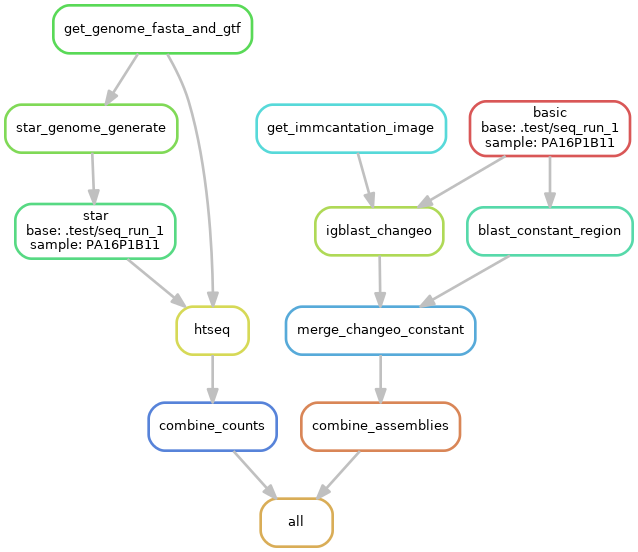

# singlecell-ige

[](https://travis-ci.org/dcroote/singlecell-ige)


Alignment and assembly workflows associated with Croote et al. (2018). These workflows were developed to analyze single human B cells isolated from the peripheral blood of food-allergic individuals and assume single-cell RNA-sequencing were data generated using the Smart-seq2 chemistry (10X and drop-seq data will not assemble).



## About

This repository contains two [snakemake](https://snakemake.readthedocs.io/en/stable/)-based [workflows](https://snakemake.readthedocs.io/en/stable/snakefiles/deployment.html) for processing scRNA-seq data. The alignment (mapping) workflow uses [STAR](https://github.com/alexdobin/STAR) and [htseq](https://htseq.readthedocs.io) whereas the antibody heavy / light chain assembly workflow uses [BASIC](https://github.com/akds/BASIC) followed by the [immcantation](https://immcantation.readthedocs.io) framework.

## Configuration

### Environment

1. These workflows assume you have `conda` (a popular [package management system](https://conda.io/docs/)) in your `PATH`. If you do not have `conda` installed, I would recommending downloading [miniconda](https://conda.io/miniconda.html) and responding `yes` when prompted to prepend the install location to your `PATH`. To test the installation run: `conda list`.

2. To launch the workflows, you need a python 3 `conda` environment with `snakemake` and `pandas` installed. This can be created by running the following:
    ```bash
    conda create -q -n snakemake_env python=3.5 snakemake-minimal pandas
    ```
    The environment can then be activated by running: `source activate snakemake_env`.

3. To avoid the challenges of installing and configuring [IgBLAST](https://ncbi.github.io/igblast/) with the necessary IMGT germline databases for V, (D), and J gene segment calling, this workflow uses the `kleinstein/immcantation` [docker / singularity image](https://hub.docker.com/r/kleinstein/immcantation/). The image will automatically be pulled as part of the workflow, simply specify whether to use the `docker` or `singularity` image in the `config.yaml` file.

### Samplesheet

The samplesheet is a two column, tab-delimited file. For each row, the `base` column specifies the path to the directory containing the folder `samplename`. It is assumed that each `samplename` is unique and that within each `base/samplename` directory there is one `*R1*.fastq.gz` file and one `*R2*.fastq.gz` file.

| base | samplename |
| --- | --- |
| /path/to/seq_run_1| cell_1 |
| /path/to/seq_run_1| cell_2 |
| ... | ... |
| /path/to/seq_run_2 | cell_500 |

### Config file

Edit the `config.yaml` file to point to your samplesheet and modify it as necessary for your sequencing data and computing environment.

## Running

Once configured, source your `conda` environment and launch the workflows with the following:

```bash
snakemake --use-conda 
```

For cluster computing (e.g. on a SLURM cluster), the following can serve as a template: 

```bash
snakemake --use-conda --cluster "sbatch --ntasks=1 \
   --job-name={params.name} --cpus-per-task={threads} --partition={params.partition} \
   --mem={resources.mem_mb} -o logs/{params.name}.%j.log" -j 10 -w 200 -k
```

If you would like to run only one of the workflows, edit the Snakefile `all` rule or add the desired output e.g. `combined_assemblies.tsv` to the end of the snakemake call.

## Expected outputs

### Assembly workflow

The final output is a tab-delimited file containing parsed assembly data from all cells. For example, here are some of the columns:

| SEQUENCE_ID | FUNCTIONAL | V_CALL | J_CALL | CDR3_IMGT | C_CALL | C_LEN | SAMPLENAME |
| --- | --- | --- | --- | --- | --- | --- | --- |
| cell_id=transcripts;heavy_chain;BASIC | T | IGHV3-23*01,IGHV3-23D*01 | IGHJ4*02 | GCGAAAGATGAGTGGAAACCACCTCGCCGCGTTGACTAC | IGHA1*01 | 1059 | PA16P1B11 |
| cell_id=transcripts;light_chain;BASIC | T | IGKV1-9*01 | IGKJ1*01 | CAACAGCTTAATTTTTATCCGTGGACG | IGKC*01 | 321 | PA16P1B11 |

### Alignment workflow

The final output is a counts table where each row is an Ensembl gene and each column is a cell.

## Testing

[Travis CI](https://travis-ci.org/dcroote/singlecell-ige) is used for automated continuous integration testing of the assembly workflow with scRNA-seq reads downsampled from two human plasmablasts. Unfortunately, the large memory requirements of STAR prevent similar testing of the alignment workflow. While not originally developed for species other than human, these workflows will also work for mouse by changing `species` in `config.yaml`.

If you would like to test the assembly workflow, edit `.test/config.yaml` according to your singularity / docker environment and then run the following from the current directory:
```
snakemake --use-conda --directory .test combined_assemblies.tsv
```

